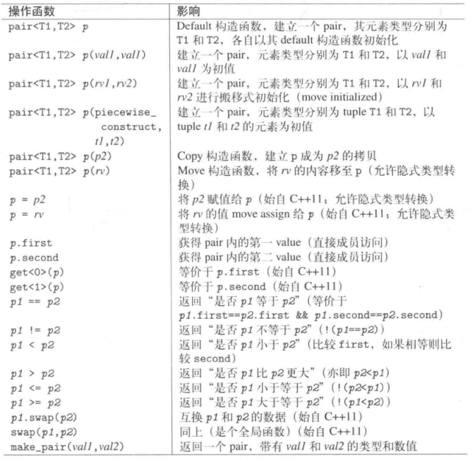
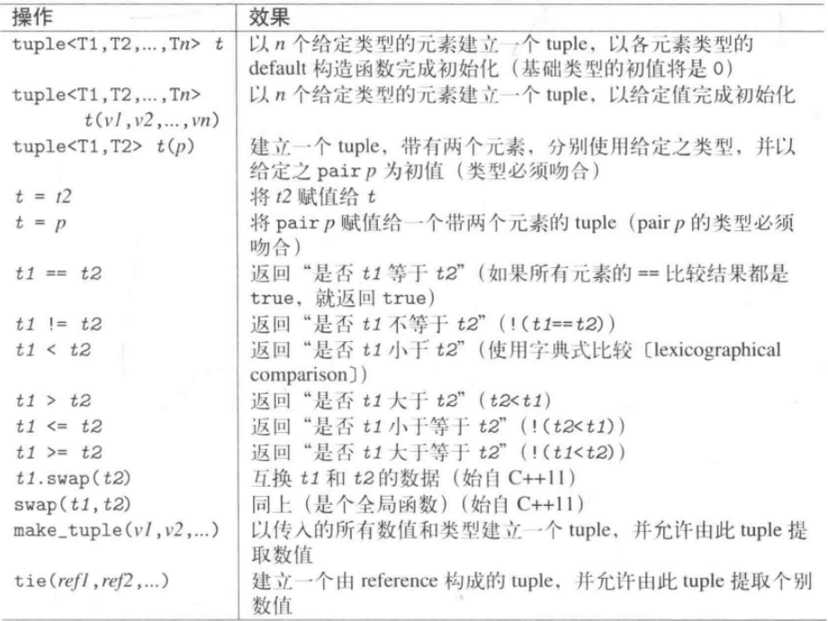

# 通用工具

## Pair和Tuple

#### Pair 

* 元素访问
class Pair将两个value视为一个单元。头文件为`<utility>`.其成员函数为public:
```
namespace std
{
    template <typename T1, typename T2>
    struct pair
    {
        T1 first;
        T2 second;
        //...
    };
}
```
pair的操作函数如下：</br>


* 构造函数和复制
Default构造函数生成pair时，分别用包含的两个元素的default构造函数初始化作为其初值。
Copy构造函数存在两个版本：(1)接受相同类型的pair;(2)是一个member template,在构造过程中需要隐式类型转换时被调用。如果pair对象被复制，调用的是被隐式合成的copy构造函数。如果pair<>用到的一个类型只有nonconstant copy构造函数，编译报错。
```
class A 
{
private:
    int a;
public:
    A(int aa):a(aa) {}
    A(A& aa) { a = aa.a;} 
    int get() { return a;}
};

void test2()
{
    pair<A, int> p; //error
}
```

* `make_pair()`
无须写出类型就能生成一个Pair对象
```
make_pair(42, 'a'); //pair<int, char>
//初始化列表构造pair
void f(pair<int, string>);
f({42, "empty"});
```
强迫使用move semantic，可以使用std::move();强迫使用reference semantic，可以使用ref()
```
void test2()
{
    int i = 2;
    //使用ref()，表示为引用语义，指向i,因此对这个值得操作会影响i的值
    auto p = make_pair(ref(i), ref(i)); //pair<int&, int&>
    ++p.first;
    ++p.second;
    cout << "i = " << i << endl; //i=4
}
```

* Pair比较
当且仅当两个元素都相等时才相等，比较时第一个元素有较高的优先级。

* Pair应用
map/multimap

#### Tuple

* 定义如下:</br>
```
namespace std {
    template <typename... Types>
    class tuple;
}
```

* 基本操作
(1) `make_tuple()`创建一个tuple</br>
(2) `get<n>(t)` 访问t的第n个元素

* 便捷函数
`make_tuple()`和`tie()`。常用的函数如下：</br>


```
void test2()
{
    tuple<int, float, string> t(42, 3.14, "hello");
    int i; 
    float f;
    string s;
    tie(i, f, s) =  t;
    cout << "i=" << i << ",f=" << f << ",s=" << s << endl;
}
```

* Tuple和初始值列表
注意：在各个构造函数中，接受不定个数的实参被声明为explicit,不能隐式转换。

* 其他Tuple特性
`tuple_size<tupletype>::value`可以获得元素个数
`tuple_element<idx, tupletype>::type`可以获取idx个元素的类型
`typle_cat()`将多个tuple连接成一个tuple

#### tuple和pair转换

使用pair初始化一个双元素的tuple,也可以将一个pair赋值给一个双元素的tuple

## Smart Point

## 数值的极限

## Type Trait

## 辅助函数

## Class ratio

## Clock 和 Timer

## 头文件